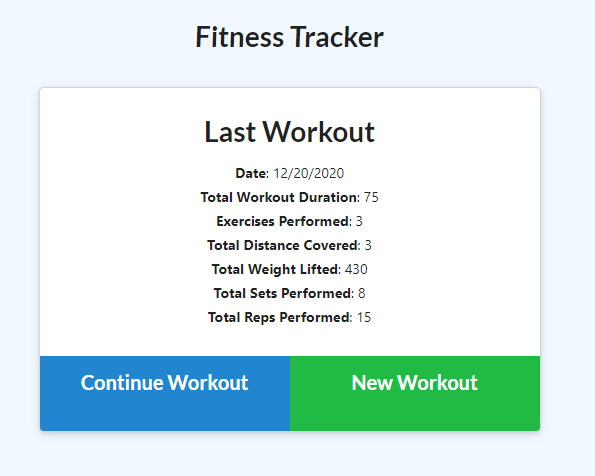
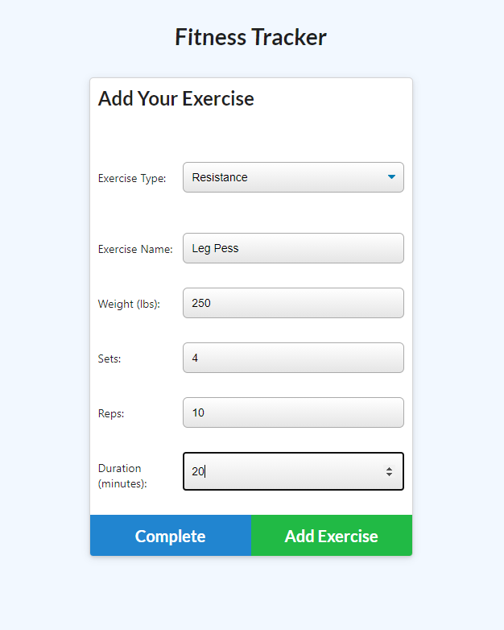
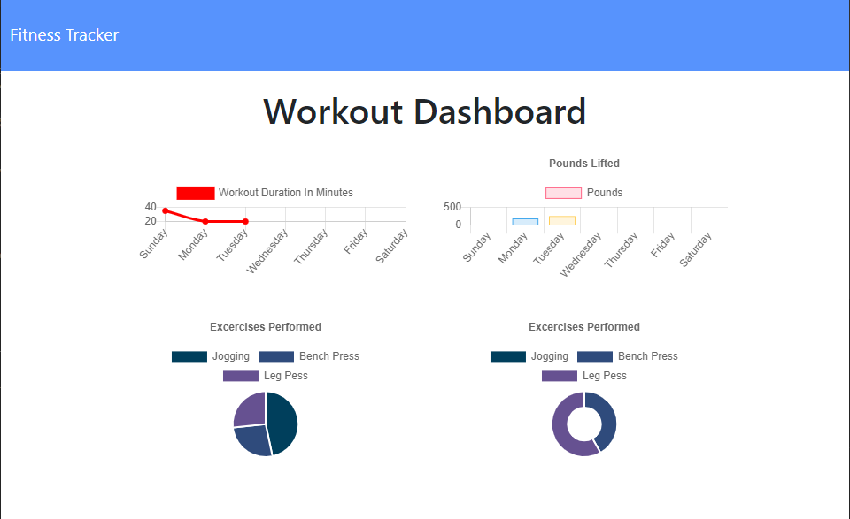

# Workout Tracker

### Github Repo Link: https://github.com/greysonkirk/FitnessTracker 

With this app the user will be able to log thier excercises and see how long they've worked out, and how much weight was lifted. 

# IMPORTANT!!! 
Heroku no longer supports mlab mongoDB and there isnt another option. For now, to run this app you will need to clone the repo and run it off your local machince. 

 

